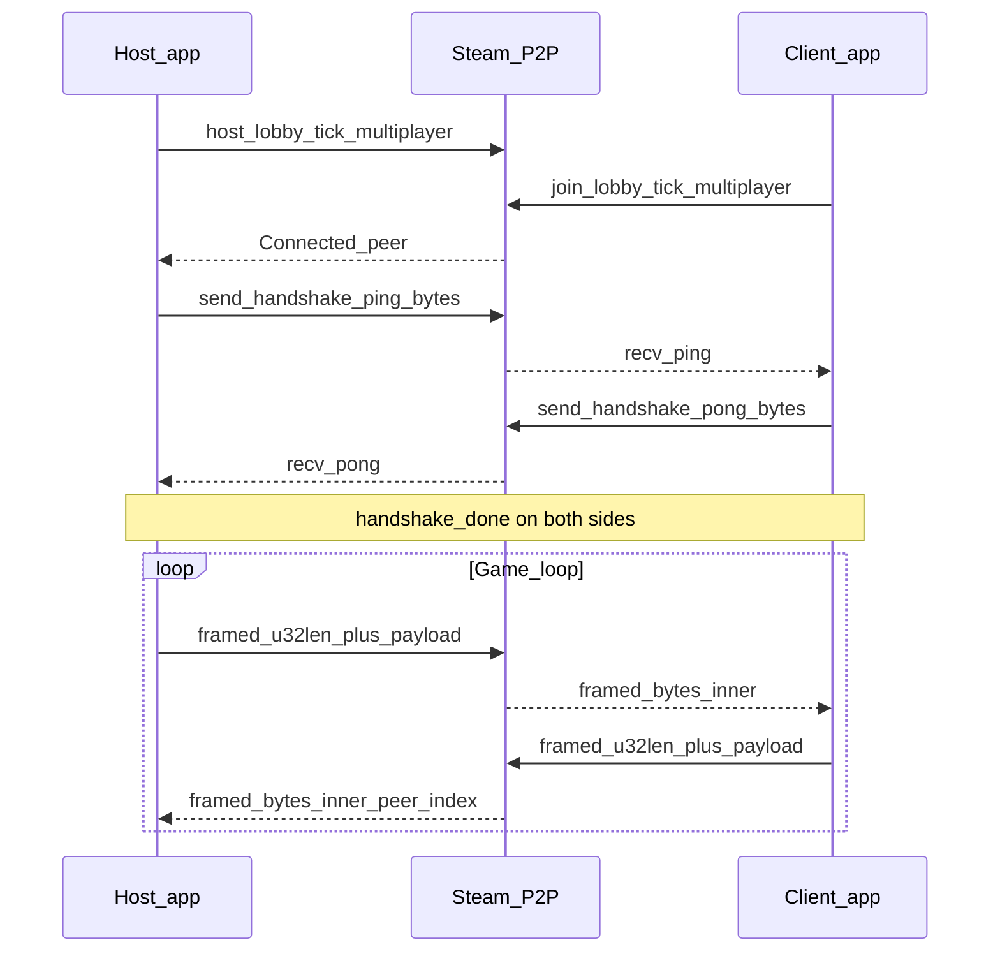
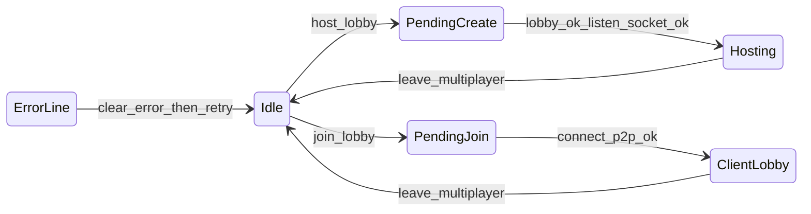

# `game_net`

Portable Rust library: **Steam lobby + SteamNetworkingSockets P2P**, a tiny **handshake**, **length-prefixed framed payloads**, and an optional **15-byte wire header** helper for versioned game packets. **No** serde schemas, **no** game enums, **no** engine bindings.

**Goal:** Drop this crate (or copy the folder) into another project and only write **your** protocol on top of the `Vec<u8>` pipe.

**New project?** Use **[../docs/game_net/integration-guide.md](../docs/game_net/integration-guide.md)** (checklist + `Cargo.toml`), then skim the sections below for wire formats and API tables. The **[documentation index](../docs/README.md)** lists all repo docs.

---

## Table of contents

- [`game_net`](#game_net)
  - [Table of contents](#table-of-contents)
  - [What this crate does](#what-this-crate-does)
  - [What you still implement](#what-you-still-implement)
  - [Cargo features](#cargo-features)
  - [Quick start](#quick-start)
  - [Architecture](#architecture)
  - [On-wire formats](#on-wire-formats)
    - [A) Handshake (not length-prefixed)](#a-handshake-not-length-prefixed)
    - [B) Game traffic (after handshake)](#b-game-traffic-after-handshake)
    - [C) Optional application header (your crate)](#c-optional-application-header-your-crate)
  - [Public API reference](#public-api-reference)
    - [`SteamSessionConfig`](#steamsessionconfig)
    - [`SteamMultiplayer`](#steammultiplayer)
    - [`FramedPayload`](#framedpayload)
    - [`NetSendReliability`](#netsendreliability)
    - [`wire_header` module](#wire_header-module)
    - [`framing` module (lower level)](#framing-module-lower-level)
  - [Per-frame integration](#per-frame-integration)
  - [Using `wire_header` without Steam](#using-wire_header-without-steam)
  - [Building and workspace layout](#building-and-workspace-layout)
  - [Dependencies and versions](#dependencies-and-versions)
  - [Further reading](#further-reading)
  - [Not included (by design)](#not-included-by-design)
  - [License](#license)

---

## What this crate does

| Layer | Responsibility |
|-------|----------------|
| **Steam** | `Client::init_app`, relay init, `create_lobby` / `join_lobby`, `create_listen_socket_p2p` / `connect_p2p` on **virtual port 0** (fixed inside the crate). |
| **Handshake** | After TCP-like connection, **host** sends `config.handshake_ping`; **client** must receive that exact bytes and reply with `config.handshake_pong`. Until then, framed game traffic is not read from sockets. |
| **Framing** | Every **game** message on the wire is `u32` **little-endian** length + **exactly** that many bytes of payload. Payload is opaque to `game_net`. |
| **Reliability** | `NetSendReliability` maps to Steam `RELIABLE_NO_NAGLE` vs `UNRELIABLE_NO_NAGLE`. |
| **Multi-peer** | Host keeps a `Vec` of peers; **send** broadcasts to all peers with `handshake_done`; **recv** returns `FramedPayload { peer_index, bytes }` so you can attribute client commands. |
| **Limits** | `recv_batch_max` caps `receive_messages` batch size per peer per call. `max_game_payload_bytes` caps the **inner** game payload (after length prefix stripped). |

---

## What you still implement

- **Serialization** (bincode, JSON, Cap’n Proto, etc.).
- **Message types**, versioning policy, **coalescing** “latest snapshot wins”, **seq / keyframes**, **encryption** if needed.
- **Application-level ping** (e.g. echo messages) if you want RTT; the **PING/PONG** in config are **not** for latency measurement, only **session gating**.
- **Gameplay authority**, validation, and desync recovery.

This crate is intentionally **thin** so those choices stay portable across game designs.

---

## Cargo features

| Feature | Default | Effect |
|---------|---------|--------|
| `steam` | **yes** | Compiles `steam_live.rs`, links `steamworks`. |
| *(disabled)* | — | Compiles `steam_stub.rs`: same type names, no SDK; useful for CI. |

Depend with explicit control:

```toml
# Point at this folder (or a vendored copy); path is relative to your crate’s Cargo.toml.
game_net = { path = "../path/to/game_net", default-features = false }
# Optional:
# features = ["steam"]
```

---

## Quick start

```rust
use game_net::{NetSendReliability, SteamMultiplayer, SteamSessionConfig};

let config = SteamSessionConfig {
    app_id: 480,
    handshake_ping: b"MYGAME_PING",
    handshake_pong: b"MYGAME_PONG",
    recv_batch_max: 32,
    max_game_payload_bytes: 1024 * 1024,
    lobby_max_members: 8,
    init_failed_log_prefix: "my_game",
};

let mut net = SteamMultiplayer::new(config);

// Each frame:
net.run_callbacks();
net.tick_multiplayer();

if net.p2p_session_ready() {
    let _ = net.try_send_framed_payload_reliability(&my_bytes, NetSendReliability::Reliable);
    for packet in net.poll_framed_payloads() {
        let _peer = packet.peer_index;
        let _game_bytes = packet.bytes;
        // decode packet.bytes in your crate
    }
}
```

Lobby flow (UI-driven):

- Host: `host_lobby()` then poll `tick_multiplayer()` until hosting; show `multiplayer_detail_lines()` / `multiplayer_error()`.
- Client: `join_lobby("aB3xYz")` with the host’s **6-character** room code (`a-z`, `A-Z`, `0-9`), stored in lobby metadata and resolved via `RequestLobbyList` before `JoinLobby`.

---

## Architecture





---

## On-wire formats

### A) Handshake (not length-prefixed)

Raw Steam message body equals **`handshake_ping`** or **`handshake_pong`** exactly (byte-for-byte). Compare with `==` on slices.

### B) Game traffic (after handshake)

```text
Offset  Size     Content
0       4        inner_len: u32 LE
4       inner_len  payload (opaque)
```

Constraints enforced when **sending** and **receiving**:

- `inner_len` as usize ≤ `max_game_payload_bytes`
- Total message size == `4 + inner_len`

### C) Optional application header (your crate)

`game_net::wire_header` defines a **separate** layout for the **inner** payload if you want cheap peek/coalesce without deserializing large bodies:

```text
Offset  Size   Content
0       2      protocol_version: u16 LE
2       1      kind: u8
3       8      tick: u64 LE
11      4      payload_len: u32 LE
15      payload_len  opaque sub-payload
```

Total inner packet size = `15 + payload_len`. Use `wire_header::parse` / `build_frame` with your own `max_payload` cap (often same as `max_game_payload_bytes`).

---

## Public API reference

### `SteamSessionConfig`

| Field | Type | Role |
|-------|------|------|
| `app_id` | `u32` | `steamworks::AppId` for `init_app`. |
| `handshake_ping` | `&'static [u8]` | First message from host on new connection. |
| `handshake_pong` | `&'static [u8]` | Client reply; must differ from ping. |
| `recv_batch_max` | `usize` | `NetConnection::receive_messages` batch cap. |
| `max_game_payload_bytes` | `usize` | Max inner game bytes (after 4-byte length stripped). |
| `lobby_max_members` | `u32` | `create_lobby` member cap. |
| `init_failed_log_prefix` | `&'static str` | Log label when Steam client fails to init. |

### `SteamMultiplayer`

| Method | Notes |
|--------|------|
| `new(config)` | Initializes Steam or offline stub state. |
| `run_callbacks()` | Forward Steam callbacks (no-op in stub). |
| `tick_multiplayer()` | **Required** each frame: lobby async, listen events, handshake state machine. |
| `host_lobby` / `join_lobby` / `leave_multiplayer` | Matchmaking entrypoints. |
| `try_send_framed_payload` | Reliable variant shorthand. |
| `try_send_framed_payload_reliability` | Reliable vs unreliable; returns `Err(())` if not ready or oversize. |
| `poll_framed_payloads` | Drains all framed messages for this tick; empty if not ready. |
| `p2p_session_ready` | At least one handshaken link (host: any peer; client: host). |
| `p2p_is_host` | Host with ≥1 handshaken peer. |
| `handshaken_peer_count` | Host: count; client: `1` if ready else `0`. |
| `multiplayer_error` | User-visible error string if in error state. |
| `multiplayer_detail_lines` / `connection_panel_lines` | Debug / UI strings. |
| `status_banner` | Short Steam sign-in line. |
| `open_overlay_invite` / `overlay_invite_available` | Steam overlay invite dialog when hosting. |

### `FramedPayload`

- **`peer_index`:** host-only discriminator for which guest sent the packet; **0** on joiner builds.
- **`bytes`:** inner payload only (length prefix already removed).

### `NetSendReliability`

- **`Reliable`:** `SendFlags::RELIABLE_NO_NAGLE`
- **`Unreliable`:** `SendFlags::UNRELIABLE_NO_NAGLE`

### `wire_header` module

- **`HEADER_LEN`** = 15
- **`WireHeader`** — parsed view
- **`parse(bytes, max_payload)`** — validates total packet length
- **`build_frame(version, kind, tick, payload, max_payload)`** — returns `Some(Vec<u8>)` or `None` if over cap

### `framing` module (lower level)

- **`strip_length_prefix`**, **`prepend_length_prefix`** — used internally by `SteamMultiplayer`; exposed for tests or custom transports.

---

## Per-frame integration

1. **`run_callbacks`** — keeps Steam state fresh.
2. **`tick_multiplayer`** — must run even when no packets to send (handshake / lobby).
3. **`poll_framed_payloads`** — consume inbound queue before sim step or after; your choice, but **once per frame** is typical.
4. **Send** — after your sim produces bytes; check `p2p_session_ready` first.

---

## Using `wire_header` without Steam

```rust
use game_net::wire_header;

let packet = wire_header::build_frame(1, 42, 999, b"hello", 1024).unwrap();
let h = wire_header::parse(&packet, 1024).unwrap();
assert_eq!(h.version, 1);
assert_eq!(h.kind, 42);
assert_eq!(h.tick, 999);
```

Useful for unit tests, replay files, or a different transport that still wants the same header layout.

---

## Building and workspace layout

**Cargo workspaces cannot list members outside their root directory**, so `game_net` is usually consumed as a **path dependency** from your game’s workspace rather than as a sibling workspace member.

```bash
# From this repository’s root (`rust-steam-framework/`):
cargo check --manifest-path game_net/Cargo.toml
cargo check --manifest-path game_net/Cargo.toml --no-default-features
```

---

## Dependencies and versions

| Crate | Role |
|-------|------|
| `steamworks` | Optional; **0.12.2** in `Cargo.toml`. Align with your game if you depend on `steamworks` directly. |

No `serde`, `bincode`, `tokio`, or game engine crates.

---

## Further reading

| Document | Purpose |
|----------|---------|
| **[docs/game_net/integration-guide.md](../docs/game_net/integration-guide.md)** | Step-by-step checklist for a new project |
| **`src/*.rs`** | Source of truth for behavior |
| **Your game crate** | Document message IDs, serialization, and reliability in your own project; `game_net` only transports opaque frames |

---

## Not included (by design)

- Serialization, game message enums, replication policies, snapshot interpolation, encryption, NAT traversal beyond Steam, non-Steam transports (you can still reuse `wire_header` / `framing`).

---

## License

`MIT` (see the repository root [LICENSE](../LICENSE) and this crate’s `Cargo.toml`).
